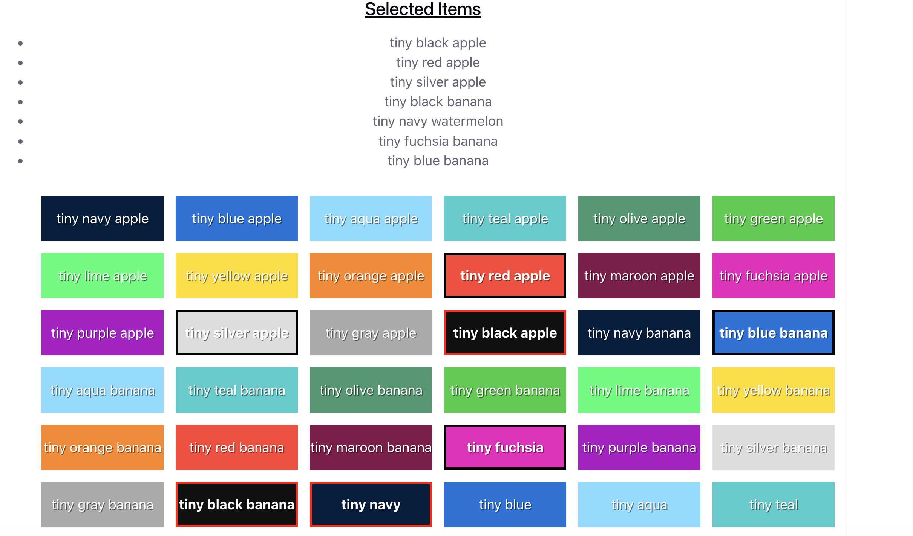

# Instructions

Implement a feature to allow item selection with the following requirements:
 - Clicking an item selects/unselects it.
 - Multiple items can be selected at a time.
 - Make sure to avoid unnecessary re-renders of each list item in the big list (performance).
 - Currently selected items should be visually highlighted.
 - Currently selected items' names should be shown at the top of the page.

Feel free to change the component structure at will.

# Screenshot below

